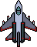

# Pigeon Invaders

A classic arcade-style space shooter game built with C++ and [raylib](https://www.raylib.com/). Defend your spaceship against waves of invading pigeons and face off against a challenging boss battle!



## Table of Contents

- [Overview](#overview)
- [Features](#features)
- [Gameplay](#gameplay)
- [Prerequisites](#prerequisites)
- [Installation](#installation)
- [Building the Project](#building-the-project)
- [Controls](#controls)
- [Project Structure](#project-structure)
- [Game Architecture](#game-architecture)
- [Contributing](#contributing)
- [License](#license)

## Overview

Pigeon Invaders is a 2D space shooter game inspired by classic arcade games like Space Invaders and Galaga. Instead of aliens, you face off against waves of pigeons that drop "poop" projectiles. Survive as long as you can, rack up points, and defeat the mighty boss pigeon!

## Features

- **Classic Arcade Gameplay**: Intuitive controls and engaging shoot-em-up action
- **Progressive Difficulty**: Enemy spawn rates and attack frequency increase over time
- **Boss Battle**: Face a challenging boss fight after surviving 90 seconds
- **Score System**: Track your performance and compete for high scores
- **Leaderboard**: View and compare scores with other players
- **Health System**: Manage your spaceship's health through strategic gameplay
- **Smooth Animations**: 60 FPS gameplay with fluid sprite rendering

## Gameplay

### Game Phases

1. **Early Game (0-30 seconds)**
   - Enemies spawn every 2 seconds
   - Enemies fire every 1 second
   - Learn the controls and build your score

2. **Mid Game (30-60 seconds)**
   - Enemies spawn every 1 second
   - Enemies fire every 0.5 seconds
   - Increased challenge requires quick reflexes

3. **Late Game (60-90 seconds)**
   - Enemies spawn every 0.5 seconds
   - Enemies fire every 0.25 seconds
   - Prepare for the boss battle

4. **Boss Fight (90+ seconds)**
   - Face the giant pigeon boss
   - Boss has 100 health points
   - Boss fires multiple projectiles in a spread pattern
   - Defeat the boss to achieve victory!

### Scoring

- Destroy enemy pigeons to increase your score
- Your score is displayed in the top-left corner of the screen
- Survive longer to face more enemies and earn more points

## Prerequisites

Before building and running Pigeon Invaders, ensure you have the following installed:

- **Visual Studio 2019 or later** (with C++ desktop development workload)
- **raylib 5.0.0** (managed via NuGet packages)
- **Windows OS** (the project is configured for Windows)

## Installation

1. **Clone the repository**
   ```bash
   git clone https://github.com/Traveler3114/PigeonInvaders.git
   cd PigeonInvaders
   ```

2. **Open the solution file**
   - Double-click `PigeonInvaders2.0C++.sln` to open in Visual Studio

3. **Restore NuGet packages**
   - Visual Studio should automatically restore the raylib package
   - If not, right-click the solution in Solution Explorer and select "Restore NuGet Packages"

## Building the Project

1. **Select build configuration**
   - Choose `Debug` or `Release` from the configuration dropdown
   - Select `x64` as the platform

2. **Build the solution**
   - Press `Ctrl+Shift+B` or go to Build → Build Solution

3. **Run the game**
   - Press `F5` to run with debugging
   - Press `Ctrl+F5` to run without debugging

## Controls

### Menu Navigation
- **Mouse Click**: Select menu options and enter username

### In-Game Controls
| Action | Key | Alternative |
|--------|-----|-------------|
| Move Up | W | - |
| Move Down | S | - |
| Move Left | A | - |
| Move Right | D | - |
| Shoot | Space | Left Mouse Button |

### Additional Notes
- Your spaceship can wrap around the screen horizontally
- The spaceship is constrained to the screen vertically
- You start with 3 health points (displayed as a blue bar)

## Project Structure

```
PigeonInvaders/
├── Resources/                  # Game assets
│   ├── background.png         # Game background
│   ├── boss.png               # Boss pigeon sprite
│   ├── laser.png              # Player bullet sprite
│   ├── pigeonleft.png         # Left-facing enemy sprite
│   ├── pigeonright.png        # Right-facing enemy sprite
│   ├── poop.png               # Enemy bullet sprite
│   └── spaceship.png          # Player spaceship sprite
├── packages/                   # NuGet packages (raylib)
├── Boss.cpp/.h                # Boss enemy class
├── Bullet.cpp/.h              # Player bullet class
├── Collisions.cpp/.h          # Collision detection system
├── Enemy.cpp/.h               # Regular enemy class
├── EnemyBullet.cpp/.h         # Enemy projectile class
├── Game.cpp/.h                # Main game logic and loop
├── GameOver.cpp/.h            # Game over screen
├── Leaderboard.cpp/.h         # Leaderboard display
├── MainMenu.cpp/.h            # Main menu interface
├── Spaceship.cpp/.h           # Player spaceship class
├── Sprite.cpp/.h              # Base sprite class
├── PigeonInvaders2.0C++.cpp   # Application entry point
├── PigeonInvaders2.0C++.sln   # Visual Studio solution
└── packages.config            # NuGet package configuration
```

## Game Architecture

### Class Hierarchy

```
Sprite (Base Class)
├── Spaceship (Player)
├── Enemy (Regular enemies)
├── Boss (Boss enemy)
├── Bullet (Player projectile)
└── EnemyBullet (Enemy projectile)
```

### Core Classes

#### Sprite
The base class for all game entities. Provides:
- Position tracking (`Vector2`)
- Texture/image management
- Movement speed
- Delta time handling
- Abstract collision event handling

#### Spaceship
The player-controlled entity featuring:
- WASD movement controls
- Shooting mechanics (Space/Mouse)
- Health management (3 HP)
- Score tracking
- Screen wrapping (horizontal)

#### Enemy
Regular pigeon enemies with:
- Automatic downward movement
- Directional sprites (left/right facing based on spawn position)
- Automatic bullet spawning
- Collision detection

#### Boss
The challenging boss enemy featuring:
- 100 health points with visible health bar
- Horizontal movement pattern (bounces off screen edges)
- Multi-projectile attack pattern (5 bullets in spread)
- Triggers at 90 seconds into gameplay

#### Collisions
Handles all collision detection between:
- Player bullets vs enemies
- Player bullets vs enemy bullets
- Player bullets vs boss
- Spaceship vs enemies
- Spaceship vs enemy bullets
- Spaceship vs boss

### Game States

The game uses a state machine with the following screens:
1. **MainMenu**: Username entry and game start
2. **Game**: Main gameplay loop
3. **GameOver**: End game screen
4. **Leaderboard**: Score display

## Contributing

Contributions are welcome! Here's how you can help:

1. **Fork the repository**
2. **Create a feature branch**
   ```bash
   git checkout -b feature/your-feature-name
   ```
3. **Make your changes**
4. **Commit your changes**
   ```bash
   git commit -m "Add your feature description"
   ```
5. **Push to your branch**
   ```bash
   git push origin feature/your-feature-name
   ```
6. **Open a Pull Request**

### Development Guidelines
- Follow existing code style and naming conventions
- Test your changes thoroughly before submitting
- Update documentation if adding new features
- Keep commits focused and atomic

## License

This project is currently not licensed. If you would like to contribute or use this code, please contact the repository owner for permission and licensing terms. Consider adding a `LICENSE` file to specify the terms under which this project can be used and distributed.

---

## Acknowledgments

- Built with [raylib](https://www.raylib.com/) - A simple and easy-to-use library for game development
- Inspired by classic arcade shooters like Space Invaders and Galaga

---

**Have fun defending Earth from the pigeon invasion! 🚀🐦**
